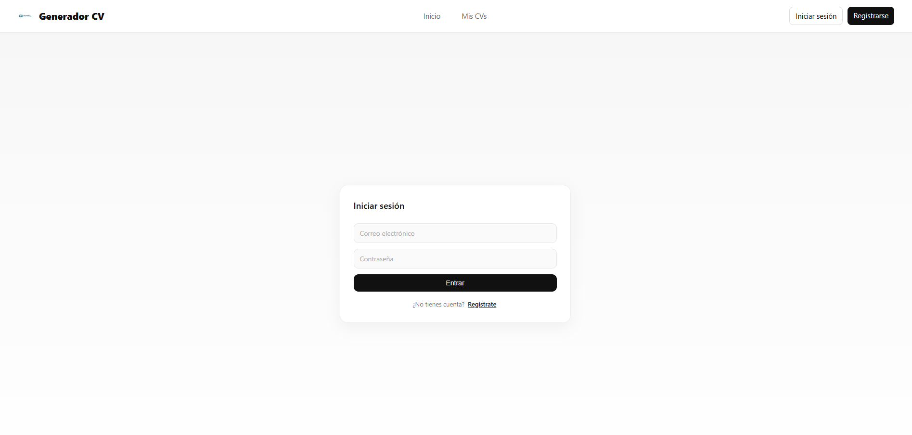
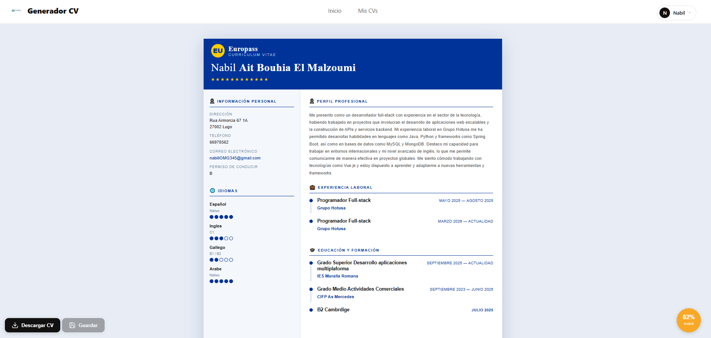
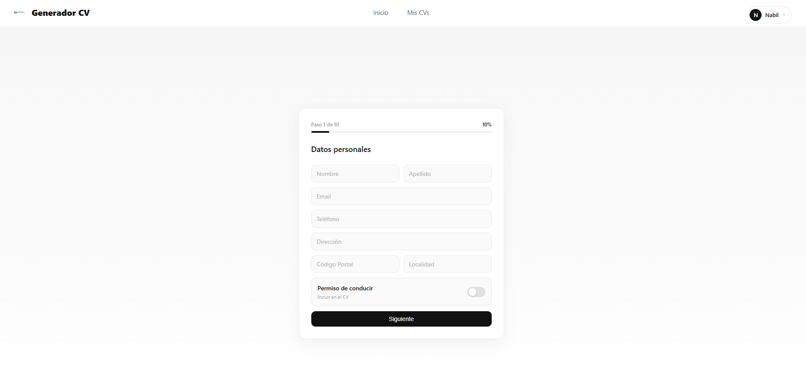
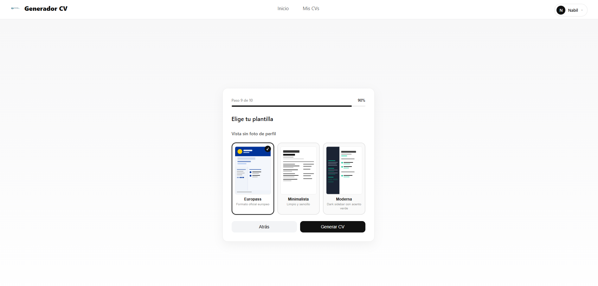
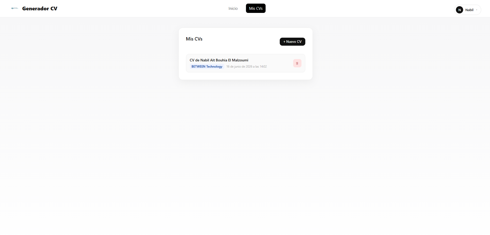
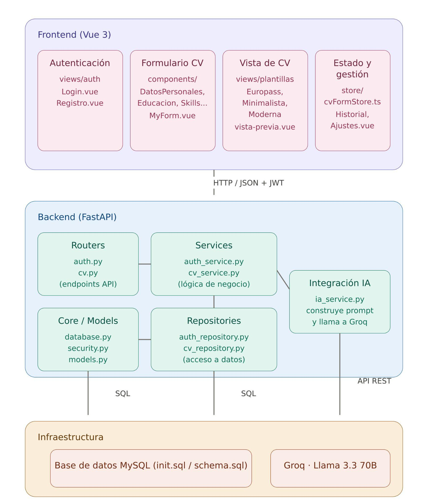
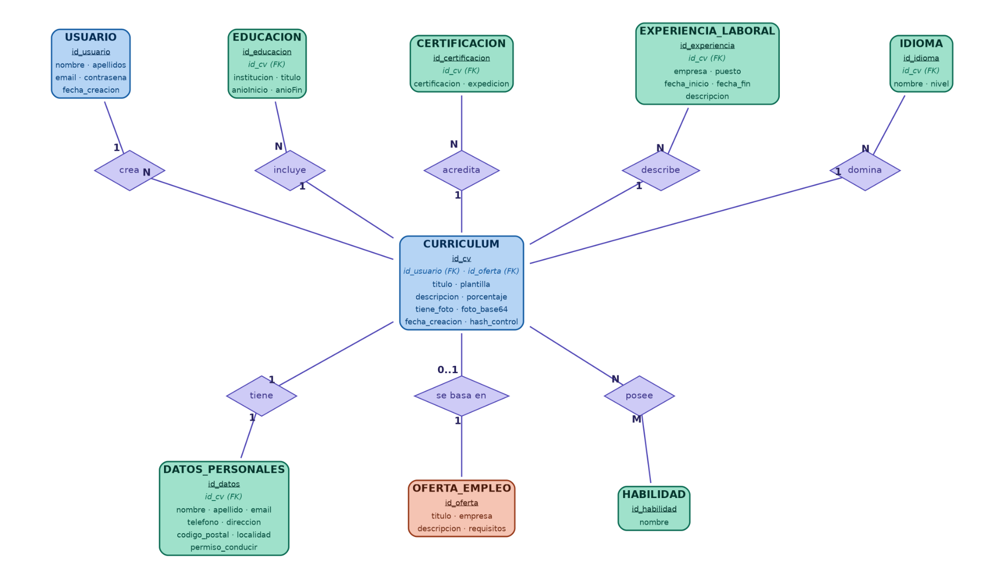
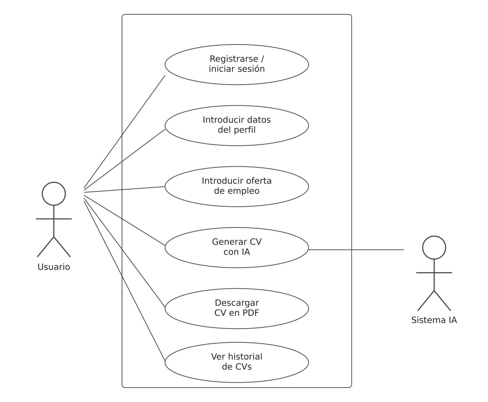

# 📌 Overview

**Generador de Currículums mediante IA** es una aplicación web que convierte cualquier oferta de trabajo en un CV optimizado para esa posición.

El usuario rellena su perfil (datos personales, formación, experiencia, idiomas y skills), pega una oferta de empleo y la IA genera una **descripción profesional a medida** junto con un **porcentaje de afinidad** con esa oferta. El CV se puede editar en línea, cambiar de plantilla y descargar en PDF.

Proyecto desarrollado como **TFG del CFGS Desarrollo de Aplicaciones Multiplataforma (DAM)**.






## ✨ Features

- Registro e inicio de sesión con **JWT** y contraseñas hasheadas.
- Gestión completa del perfil: datos personales, formación, certificaciones, experiencia laboral, idiomas y skills (CRUD).
- Foto de perfil opcional.
- Generación del CV con **IA (Llama 3.3 70B vía Groq)** en menos de 10 segundos.
- **Porcentaje de match** entre el perfil y la oferta de empleo introducida.
- 3 plantillas: **Europass**, **Minimalista** y **Moderna**.
- Edición in-line de cualquier campo del CV generado.
- Exportación a **PDF**.
- Historial de CVs (consultar, reabrir y eliminar).
- Despliegue completo con **Docker** en un solo comando.
- Si el servicio de IA falla, se aplican valores por defecto sin bloquear el guardado del CV.

## 🛠️ Stack

- [Vue 3](https://vuejs.org/): framework frontend reactivo con Composition API.
- [TypeScript](https://www.typescriptlang.org/): tipado estático en el frontend y en el store.
- [FastAPI](https://fastapi.tiangolo.com/): framework backend en Python con validación automática y Swagger.
- [SQLAlchemy](https://www.sqlalchemy.org/): ORM para el acceso a datos.
- [MySQL](https://www.mysql.com/): base de datos relacional.
- [Groq](https://groq.com/): inferencia del modelo Llama 3.3 70B vía API.
- [JWT](https://jwt.io/): autenticación mediante tokens con expiración.
- [html2pdf.js](https://ekoopmans.github.io/html2pdf.js/): exportación del CV a PDF.
- [Docker](https://www.docker.com/): contenerización de frontend, backend y base de datos.

## 🚀 Run application

1. Clona el repositorio.
2. Crea una copia de `.env.template`, renómbrala a `.env` y rellena las variables de entorno (API key de Groq, secret de JWT, credenciales de MySQL).
3. Levanta el proyecto con `docker-compose up --build`.
4. Para parar: `docker-compose down` · Para parar y borrar los datos: `docker-compose down -v`.

| Servicio | URL |
|---|---|
| Frontend | http://localhost:5173 |
| Backend (API) | http://localhost:8001 |
| Documentación API (Swagger) | http://localhost:8001/docs |

> La API key de Groq se obtiene gratis en [console.groq.com](https://console.groq.com).

## 📸 Screenshots

**Inicio de sesión**


**Formulario multipaso**



**Selección de plantilla**



**Historial de CVs**



## 📁 Project Structure

```
├─ frontend
│  ├─ src
│  │  ├─ views
│  │  │  ├─ auth
│  │  │  │  ├─ Login.vue
│  │  │  │  └─ Registro.vue
│  │  │  ├─ components
│  │  │  │  ├─ DatosPersonales.vue
│  │  │  │  ├─ Educacion.vue
│  │  │  │  ├─ Certificaciones.vue
│  │  │  │  ├─ Experiencia.vue
│  │  │  │  ├─ Idiomas.vue
│  │  │  │  ├─ Skills.vue
│  │  │  │  ├─ OfertaDeTrabajo.vue
│  │  │  │  ├─ FotoDePerfil.vue
│  │  │  │  └─ ElegirPlantilla.vue
│  │  │  ├─ plantillas
│  │  │  │  ├─ PlantillaEuropass.vue
│  │  │  │  ├─ PlantillaMinimalista.vue
│  │  │  │  └─ PlantillaModerna.vue
│  │  │  ├─ MyForm.vue
│  │  │  ├─ vista-previa.vue
│  │  │  ├─ HistorialFormularios.vue
│  │  │  └─ Ajustes.vue
│  │  └─ store
│  │     └─ cvFormStore.ts
│  └─ Dockerfile
├─ backend
│  ├─ app
│  │  ├─ routers
│  │  │  ├─ auth.py
│  │  │  └─ cv.py
│  │  ├─ services
│  │  │  ├─ auth_service.py
│  │  │  ├─ cv_service.py
│  │  │  └─ ia_service.py
│  │  ├─ repositories
│  │  │  ├─ auth_repository.py
│  │  │  └─ cv_repository.py
│  │  ├─ core
│  │  │  ├─ database.py
│  │  │  └─ security.py
│  │  └─ models
│  │     └─ models.py
│  └─ Dockerfile
├─ db
│  ├─ init.sql
│  └─ schema.sql
└─ docker-compose.yml
```

## 🏗️ Architecture



El frontend envía el perfil y la oferta al backend mediante HTTP/JSON con JWT. `ia_service.py` construye el prompt y consulta la API de Groq, el CV generado se persiste en MySQL y se devuelve al cliente para su edición y exportación a PDF.

## 🗄️ Data Model



## 🎯 Use Cases



## 🔭 Roadmap

- [ ] Más plantillas y personalización avanzada del diseño.
- [ ] Interfaz y CVs multi-idioma.
- [ ] Integración con LinkedIn / InfoJobs.
- [ ] Exportación a Word además de PDF.
- [ ] Formulario de feedback para afinar los prompts.

## 👤 Author

**Nabil Ait Bouihia El Malzoumi** — TFG · CFGS DAM
